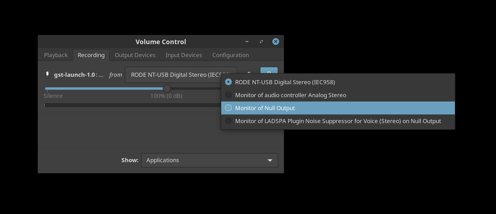
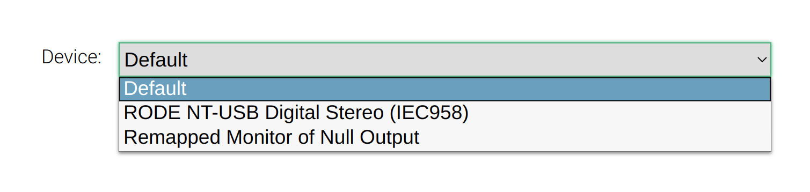

Real-time Noise Suppression in PulseAudio
=========================================

With people doing video conferencing all day, good audio has recently become much more important.
The best option is obviously a proper audio studio.
Unfortunately, this is not something you will always have and you might need to make do with a much simpler setup.

In such situations, a noise reduction filter that keeps your voice but filters out ambient noises (street noise, keyboard, …) can be very helpful.
In this article, we will take a look at how to integrate such a filter into PulseAudio
so that it can easily be used in all applications with no additional requirements on their part.

Example of me switching on noise reduction:

<audio controls>
  <source src="test.m4a" type="audio/mp4">
</audio>


The Idea
--------

We set up [PulseAudio](https://freedesktop.org/wiki/Software/PulseAudio/) for live noise-reduction
using [an LADSPA filter](https://github.com/werman/noise-suppression-for-voice).

This creates a new PulseAudio source which can be used as a virtual microphone.
Other applications do not even realize that they are not dealing with a physical device
and you can select it as if you had an additional microphone connected.


Terminology
-----------

Before we start, it is good to know the following two PulseAudio terms to better understand what we are doing:

- _source_ – represents a source from which audio can be obtained like a microphone
- _sink_ – represents a consumer of audio like a speaker

Each PulseAudio sink also has a source called monitor which can be used to get the audio put into that sink.
For example, you could have audio put out by your headphones while using the monitor of your headphone device to record the output.


Installation
------------

We need to install the LADSPA filter we use for noise reduction in PulseAudio.
For this, head [over to the project page](https://github.com/werman/noise-suppression-for-voice) and build the filter
following the instructions provided in the readme file
or download the pre-compiled library.

It is easier if you use Fedora Linux.
In that case, you can instead install the filter via Copr:

```sh
sudo dnf copr enable -y lkiesow/noise-suppression-for-voice
sudo dnf install -y ladspa-realtime-noise-suppression-plugin
```


Enable Noise Reduction Filter
-----------------------------

First, you need to identify the name of the device you want to apply the noise reduction to.
In my case, I want to use my RODE NT-USB microphone as input.

```
$ pactl list sources short
 0   alsa_input.usb-RODE_Microphones_RODE_NT-USB-00.iec958-stereo       ...
 1   alsa_output.usb-0c76_USB_Headphone_Set-00.analog-stereo.monitor    ...
```

Next, we create a new PulseAudio sink, the filter and a loopback between microphone and filter.
That way, the output from the microphone is used as input for the noise reduction filter.
The output from this filter will then be available via the null sink monitor.

To visualize this, here is the path the audio will travel from the microphone to, for example, a browser:

```
mic → loopback → ladspa filter → null sink | null sink monitor → browser
```

While this sounds complicated, it is set up with just a few simple commands:

```
pacmd load-module module-null-sink \
    sink_name=mic_denoised_out
pacmd load-module module-ladspa-sink \
    sink_name=mic_raw_in \
    sink_master=mic_denoised_out \
    label=noise_suppressor_stereo \
    plugin=librnnoise_ladspa \
    control=50
pacmd load-module module-loopback \
    source=alsa_input.usb-RODE_Microphones_RODE_NT-USB-00.iec958-stereo \
    sink=mic_raw_in \
    channels=2
```

That's it.
You should now be able to select the new device:



Chromium
--------

Unfortunately, browsers based on Chromium will hide monitor devices by default.
This means, that we cannot select the newly created noise-reduction device in the browser.
One workaround is to select another device first, then use pavucontrol to assign the noise-reduction device afterwards.

But if you do this on a regular basis, you can work around the issue by usingthe
[remap-source module](https://www.freedesktop.org/wiki/Software/PulseAudio/Documentation/User/Modules/#module-remap-source)
to convert the null sink monitor into a regular PulseAudio source.
The module is actually meant for remapping audio channels – e.g. swapping left and right channel on stereo audio –
but we can just ignore these additional capabilities and create a new source similar to the monitor:

```
pacmd load-module module-remap-source \
    source_name=denoised \
    master=mic_denoised_out.monitor \
    channels=2
```

The remapped device delivers the same audio the original one does and assigning this with PulseAudio will yield no difference.
But this device does now show up in Chromium:




Improvements
------------

While the guide above should help you with all the basics
and will get you a working setup, there are a few things you can improve.

But while the commands above should generally work,
you might need to experiment with the following suggestions.


### Latency

By default, the [loopback module](https://www.freedesktop.org/wiki/Software/PulseAudio/Documentation/User/Modules/#module-loopback)
will introduce a slight audio latency.
You can hear this by running an echo test:

```sh
gst-launch-1.0 pulsesrc ! pulsesink
```

You might be able to reduce this latency by using the `latency_msec` option when loading the loopback module:

```
pacmd load-module module-loopback \
    latency_msec=1 \
    source=alsa_input.usb-RODE_Microphones_RODE_NT-USB-00.iec958-stereo \
    sink=mic_raw_in \
    channels=2
```

### Voice Threshold

The noise reduction library provides controls for a voice threshold.
The filter will return silence if the probability for sound being voice is lower than this threshold.
In other words, the higher you set this value, the more aggressive the filter becomes.

You can pass different thresholds to the filter by supplying them as control argument when the ladspa-sink module is being loaded.

```
pacmd load-module module-ladspa-sink \
    sink_name=mic_raw_in \
    sink_master=mic_denoised_out \
    label=noise_suppressor_stereo \
    plugin=librnnoise_ladspa \
    control=95
```

### Mono vs Stereo

The example above will work with stereo audio.
When working with a simple microphone, you may want to use a mono signal instead.

For switching to mono, use the following values instead when loading the different modules:

- `label=noise_suppressor_mono` when loading the ladspa-sink module
- `channels=1` when loading the loopback and remap-source modules


### Persistence

Using the `pacmd` command for the setup, settings are not persistent and will disappear if PulseAudio is restarted.
You can add these commands to your PulseAudio configuration file if you want them to be persistent.
For that, edit `~/.config/pulse/default.pa` and add your commands like this:

```
.include /etc/pulse/default.pa

load-module module-null-sink sink_name=mic_denoised_out
load-module module-ladspa-sink ...
...
```

Limitations
-----------

If you listen to the example above, you will notice that the filter reliably reduces background noise.
But unfortunately, depending on the situation, it can also cause a loss in voice quality.

The following example shows the results with some street noise.
Activating the filter reliably removes the noise, but in this example, the voice quality noticeably drops as well:

<audio controls>
  <source src="street.m4a" type="audio/mp4">
</audio>

As a conclusion, we can say that this can help if you find yourself in less than ideal audio scenarios.
It is also very effective if you are not the main speaker in a vide conference and you do not want to constantly mute yourself.

Still, good audio equipment and a quiet environment will always be better.


Have fun.


<time>Sun 05 Jul 2020 03:07:08 PM CEST</time>
