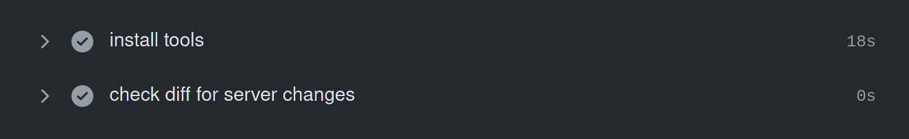

Run GitHub Actions only if Path was Modified
============================================

> Thanks to [Andrew Wilson](https://twitter.com/android_wiltron) for sharing a far superior way of doing this.
> Turns out GitHub Actions has a built-in _paths_ feature.
> I've updated the post.

Having tests which automatically run if you get a pull request on GitHub helps a lot.
Developers don't need to test patches only to find out they don't actually compile.
Contributors get a very fast first feedback.
There are lots of good reasons to have them.

But especially in larger projects with a lot of code and tests, you don't want to run all tests every time.
There are several good reasons for that:

- Developers do not have to wait for unnecessary tests to finish
- Reduced chance of false positives (e.g. due to network failure)
- Reduced environmental impact (less computation means less energy consumption)


Run some tests only if relevant paths are modified
--------------------------------------------------

Suppose that you have a folder `server` in your repository which contains the server parts of your project,
and you have a test suite just for that part.
If you get a pull request only modifying the `frontend` folder, there is no need to run those tests.

It would be great to have certain jobs be skipped if there are no modifications.
Something like:

```pascal
if `/server` was modified then
  run server tests
end

if `/frontend` was modified then
  run frontend tests
end
```


GitHub Actions Paths
--------------------

GitHub Actions [supports `paths` and `paths-ignore` for workflows](https://docs.github.com/en/actions/reference/workflow-syntax-for-github-actions#onpushpull_requestpaths)
allowing for workflows to be run only if a specific path is modified or, in case of `paths-ignore`, untouched.
You can specify paths for both pull requests and push events like this:

```yml
on:
  pull_request:
    paths:
      - docx/**
```


## Old solution below

---


### GitHub Actions

GitHub Actions allows you to react to the output of previous steps.
So we can build a step which checks for what has changed
and then use the output of this step to decide if a subsequent steps will be skipped.

For this to work, you must print a special GitHub Actions output command in your step which then becomes a variable you can access later.
The following code generates an output variable named `changed` and sets its value to `true`:

```
::set-output name=changed::true
```

Now we just need to identify if a certain path has been modified.
The first idea that comes to mind is to use git for testing what has changed.
But that is hard with GitHub Actions not checking out the code by default and usually checking out a single pull request commit instead of the actual tree.

Fortunately, GitHub also provides a patch file containing all changes of a pull request,
and we can use `lsdiff` from the `patchutils` to easily analyze this:

The operation would look like this:

```
% curl -s -L https://github.com/opencast/opencast/pull/200.patch | lsdiff
a/modules/admin-ui/src/main/webapp/scripts/shared/wizards/new-event.html
```

This makes it easy to check for certain modifications.
You can do that:

- Using `lsdiff | grep -q '^./server/'` as test
- Using `lsdiff --include='?/server/*'` and then test for an empty output
- Using `lsdiff | sed -n 's_^./mod.*$_..._p' | uniq` to directly generate the output command.

Using `sed` to directly turn the output into the output command is certainly nice but also very cryptic for anyone not knowing `sed` and/or uncomfortable with regular expressions.
The `--include` argument of `lsdiff` works great but requires an additional `test` command.
So let's run with `grep` since it seems to be the simplest option.

Now, let's turn that into a workflow:

```yml
steps:
  - name: install tools
    run: |
      sudo apt update -q
      sudo apt install -qqy patchutils curl

  - name: check diff for server changes
    id: check-changes
    env:
      CHECK_PATH: /server/
    run: |
      if curl -s -L ${{ github.event.pull_request.patch_url }} | lsdiff | grep -q "^.${CHECK_PATH}"
      then
      echo '::set-output name=changed::true'
      fi

  - name: Only if server changed
    if: ${{ steps.check-changes.outputs.changed == 'true' }}
    run: |
      echo Server code has changed. Do something!
```

Explanation for the steps:

1. The first step should be more or less obvious.
   We need to make sure that `curl` and `lsdiff` are installed.

2. The second step is our actual check.
   It is important to assign an `id` to be able to access the output later.
	To get the location of the patch file, we can use `github.event.pull_request.patch_url`.
	The path was set in an environment variable to make configuration easier.
	If our test succeeds, we have an echo command writing some output.

3. Finally, we check if we run the last step only if our test for the given path succeeded.
   The syntax for checking output is `steps.<step-id>.outputs.<outpot-name>`.


### Conclusion

This is an easy way to decide if you want to run certain steps.
Though by using the pull request patch files, this will work only for checks on pull requests, not on push events.

You should also think about how long your actual tests run since these checks add additional complexity and work.
It is not much but if your test only runs a few seconds it may not be worth it.
This shows a run with how long the steps took to complete:



For me, I involved in several projects having tests usually running more than 10 minutes for which this is great.

Have fun trying this for yourself.


<time>Sun Jan 24 02:22:50 PM CET 2021</time>
