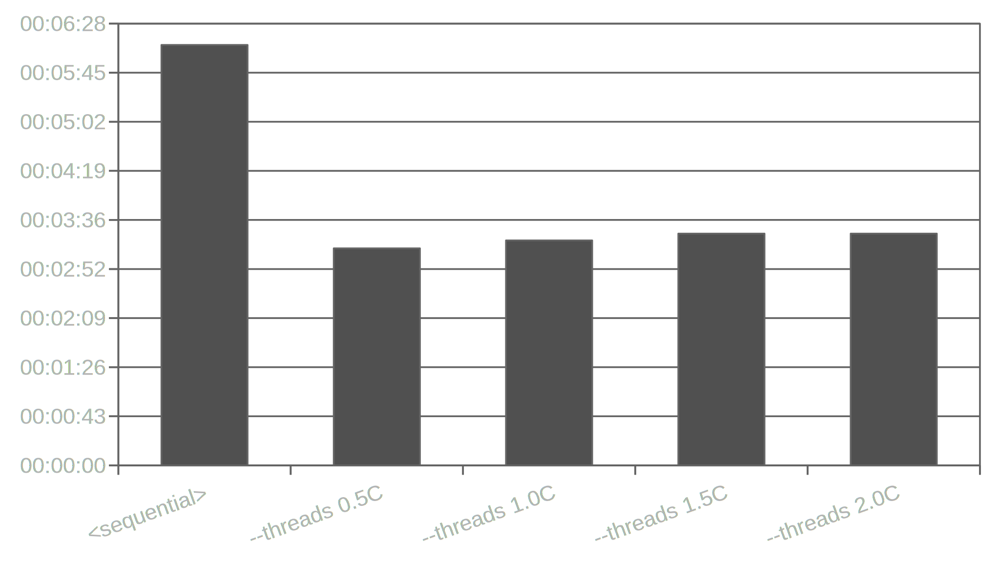

Parallel Maven Builds (Opencast)
================================

Maven's `--threads` option was introduced about 11 years ago, but is still disabled by default and is often tricky to use.
Nevertheless, in a time of more and more cores in common developer systems,
it can greatly reduce the build time.

This article explores options and shows a short benchmark using different settings.

All tests were run on:

- Opencast `develop` branch commit `4b7beb7` with few modifications explained later
- Fedora release 34
- AMD Ryzen 7 2700 (8 cores/16 threads)
- Samsung 960 EVO
- 16 GB RAM


Problem: Project Structure
--------------------------

Opencast's main `pom.xml` defines sub-projects to be run like this:

- `mudule/a`
- `mudule/b`
- `mudule/c`
- `mudule/…`
- `assemblies`

This final assembly step takes all modules built before to creates distribution archives.
The assemblies do not specify dependencies to all modules to not track the multiple times.
Building these in parallel can thus cause broken distributions with missing or incorrect content.
After all, Maven does not know that it would have to wait before building this sub-project.

To work around it, we will run all builds with `-Pnone`, causing no assemblies to be build
and then building these in a second invocation of Maven.

This means, we will also do separate benchmarks for building the modules and assembling the distributions.


Problem: Maven Plugins
----------------------

Despite being introduced over 10 years ago, not all Maven plugins work well with the `--threads` option.
This meant I had to update and/or deactivate a few plugins for this test.
For more details, take a look at pull request:

- [Fix Maven Plugin Multithreading Problems (#2863)](https://github.com/opencast/opencast/pull/2863)

Test Runs
---------

To ensure we have similar conditions for all tests,
we build once in online mode before running the tests and then set Maven to offline.
Unfortunately, some other components of Opencast require an internet connection
and will always download artifacts (e.g. the Paella player JavaScript code).
But we can at least reduce this to a minimum.

Then, we run the tests in sequence with nothing else running on the system.
The tests we run are:

```sh
#!/bin/sh

# basic maven command
MVN="mvn clean install --batch-mode --offline -DtrimStackTrace=false"

# one online build to prepare
mvn clean install --batch-mode -DtrimStackTrace=false

set -x

# test full build
/usr/bin/time -p bash -c "$MVN -Pnone"                &> build.sequential.log
/usr/bin/time -p bash -c "$MVN -Pnone --threads 0.5C" &> build.parallel0.5.log
/usr/bin/time -p bash -c "$MVN -Pnone --threads 1.0C" &> build.parallel1.0.log
/usr/bin/time -p bash -c "$MVN -Pnone --threads 1.5C" &> build.parallel1.5.log
/usr/bin/time -p bash -c "$MVN -Pnone --threads 2.0C" &> build.parallel2.0.log

# test build without tests
/usr/bin/time -p bash -c "$MVN -Pnone -DskipTests"                &> build.skipTests.sequential.log
/usr/bin/time -p bash -c "$MVN -Pnone -DskipTests --threads 0.5C" &> build.skipTests.parallel0.5.log
/usr/bin/time -p bash -c "$MVN -Pnone -DskipTests --threads 1.0C" &> build.skipTests.parallel1.0.log
/usr/bin/time -p bash -c "$MVN -Pnone -DskipTests --threads 1.5C" &> build.skipTests.parallel1.5.log
/usr/bin/time -p bash -c "$MVN -Pnone -DskipTests --threads 2.0C" &> build.skipTests.parallel2.0.log

# test assembling all distributions
/usr/bin/time -p bash -c "cd assemblies; $MVN"                &> assemblies.all.sequential.log
/usr/bin/time -p bash -c "cd assemblies; $MVN --threads 0.5C" &> assemblies.all.parallel0.5.log
/usr/bin/time -p bash -c "cd assemblies; $MVN --threads 1.0C" &> assemblies.all.parallel1.0.log
/usr/bin/time -p bash -c "cd assemblies; $MVN --threads 1.5C" &> assemblies.all.parallel1.5.log
/usr/bin/time -p bash -c "cd assemblies; $MVN --threads 2.0C" &> assemblies.all.parallel2.0.log

# test assembling developer distribution only
/usr/bin/time -p bash -c "cd assemblies; $MVN -Pdev"                &> assemblies.dev.sequential.log
/usr/bin/time -p bash -c "cd assemblies; $MVN -Pdev --threads 0.5C" &> assemblies.dev.parallel0.5.log
/usr/bin/time -p bash -c "cd assemblies; $MVN -Pdev --threads 1.0C" &> assemblies.dev.parallel1.0.log
/usr/bin/time -p bash -c "cd assemblies; $MVN -Pdev --threads 1.5C" &> assemblies.dev.parallel1.5.log
/usr/bin/time -p bash -c "cd assemblies; $MVN -Pdev --threads 2.0C" &> assemblies.dev.parallel2.0.log
```

The `1.0C` argument used in the `--threads` option is a modifier to the number of system cores.
For the machine I run the tests on, this means we test

- sequentially,
- with 8 threads,
- with 16 threads,
- with 24 threads,
- with 32 threads.


Full Build
----------

First, let's take a look at a full build of all modules with all tests enabled, skipping the assembly step.

Building with multiple threads easily cuts down the time to approximately a third of the time we need for a sequential build.
What is interesting, is that there does not seem to be any benefit in building with more than 8 threads, though.

<center>
  <br />
  <em>Build time in minutes for a full build.</em><br />
</center>

Approximately 8 minutes faster is quite impressive and helpful.


Skipping Tests
--------------

Of course, there are lots of cases where developers want to have the fastest builds possible.
With all tests being run on the CI servers anyway, nowadays, it is often okay to skip some tests locally.
Let's take a look at what happens if we build using `-DskipTests`:

<center>
  <br />
  <em>Build time in minutes for a build with skipped tests.</em><br />
</center>

This still cuts the build time in half compared to the sequential build.
What is interesting, though, is that a full parallel build with tests is still substantially faster than a sequential build without tests.
Also, disabling tests only shaves a bit more than a minute off the build time for parallel builds.
That's not that much.


Assembling Distributions
------------------------

Now let's take a look at the assembly step and if we can speed that one up as well.

<center>
  <br />
  <em>Build time in seconds for all distributions (`-Pall`).</em><br />
</center>

And again, we need less than a third of what we need for a sequential build.
I assume, this also heavily relies on fast storage, but I did not test that any further.


Development Distribution
------------------------

But, again, developers what speed and convenience
and thus most developers build using `-Pdev` which only activates a single, already unpacked distribution.
How does parallel builds effect this?

<center>
  <br />
  <em>Build time in seconds for development distributions (`-Pdev`).</em><br />
</center>

As one can see, for a single distribution, there is no benefit – but also no penalty – in building with multiple threads.

More than that, as a developer, it still makes sense to use the development distribution.
Not only is it slightly faster still – even though only about 10 seconds –
it also prepares the distribution, so you can start it up directly with no additional steps.

Conclusion
----------

Using Maven's `--threads` option can make builds significantly faster.
Unfortunately, it is still somewhat complicated and fragile.

Despite that, the minutes of build time for each build are probably worth the effort.


### Improvements

Apart from broken plugins,
the main problem is the dependency between the assembly steps and the modules.

One solution for this would certainly be to make the assembly steps each depend on all modules.
The problem with this is that you have to track modules at several places,
creating opportunity for human error, since it is easy to forget updating a module at one place.

A nice way would be to add a meta project or profile containing all modules – e.g. additional `pom.xml` in the modules folder –
making the assembly steps depend on this.
But the details or even if this is easily achievable need more research.


<time>Mon Jul 26 10:36:54 AM CEST 2021</time>
