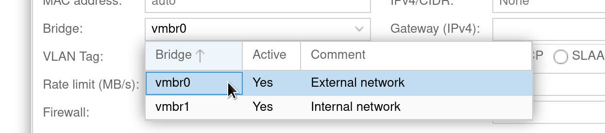

Internal Network
================

In some cases you don't want a bridged interface for all your virtual machines,
but want a server internal network instead.

Reasons for this may vary from you not wanting to expose machines to the public network,
but also because bridged interfaces may interfere with enterprise networks.

For example, in the main enterprise network I operate in,
every machine has to be registered with a central IP Address Management (IPAM) solution.
Adding an internal network allows us to be less restricted,
just assign any internal machine an IP address via DHCP
and provide a way for them to route to the internet.

The downside to this is that you will loose network transparency.
This means that, for example, if one of the servers machines starts to go on a rampage,
it will look as if the traffic is coming from the server itself.
That means our technicians would identify the server as the attacker, not one of the virtual machines
and would cut its network access along with all machine running on the server.

This is a risk I'm taking for our test machines as a trade-off for the ease of use.
But it is something to be aware of.


## Create an Internal Network

As a starting point, you can create a new network bridge in the Proxmox web interface.
Doing that will give you a good starting point for modifying the configuration later on,
especially if you do this the first time.
It's not strictly necessary, though.

If you want to use the web interface to get started, head to `Datacenter` → `Your Server` → `Network`,
click `Create` → `Linux Bridge` and set something like:

- Name: `vmbr1`
- IPv4/CIDR: `10.0.0.1/16`
- Autostart: ✓
- Comment: Internal network

You can also add this on the server directly by editing `/etc/network/interfaces`.
In the file, just add a configuration block like:

```
auto vmbr1
iface vmbr1 inet static
   address 10.0.0.1/16
   bridge-ports none
   bridge-stp off
   bridge-fd 0
```

You should also have this block if you used the web interface to add the bridge.

This example will give you an internal `/16` network which will be more than sufficient for your inter machine configuration.
In most cases, using a `/24` network instead should also suffice.

Finally, bring your new network interface up using:

```
❯ ifup vmbr1
```

You can check the status of the new interface running:

```
❯ ip a
...
7: vmbr1: <NO-CARRIER,BROADCAST,MULTICAST,UP> mtu 1500 qdisc noqueue state DOWN group default qlen 1000
    link/ether 26:b2:ce:3b:75:c3 brd ff:ff:ff:ff:ff:ff
    inet 10.0.0.1/16 scope global vmbr1
       valid_lft forever preferred_lft forever
```


## Commenting on Networks

While technically not important,
I highly recommend adding descriptions for the network interface
which will become visible in the Proxmox web interface.
This makes it much easier to remember what these interfaces are for.
Something like:

- `vmbr0`: External network
- `vmbr1`: Internal network

You can add these in `/etc/network/interfaces` by adding a comment directly after the interface configuration block like this:

```
iface vmbr0 inet static
   ...
   bridge-fd 0
#External network
```

These comments will later appear in the network selection dialog of the web interface:



If you don't do that, it's almost guaranteed that people will select the wrong interface for their use-case on a regular basis.


## NAT Configuration

While you can already create machines and assign the new interface,
these machines can not route to the internet.
This can be the desired state if you want a completely separate network.
Usually, you want machines to be able to reach the internet though.

For this, we want a NAT configuration.
Imagine this as your home router which will route traffic from your home network to the internet,
and then return results to the request source.

To configure this, edit the file `/etc/network/interfaces` and add the following configuration to your new interface:

```
iface vmbr1 inet static
   ...
   post-up   echo 1 > /proc/sys/net/ipv4/ip_forward
   post-up   iptables -t nat -A POSTROUTING -s '10.0.0.0/16' -o vmbr0 -j MASQUERADE
   post-down iptables -t nat -D POSTROUTING -s '10.0.0.0/16' -o vmbr0 -j MASQUERADE
```

This rule will create a dynamic source NAT where every packet from `10.0.0.0/16` will be sent to the interface `vmbr0`
and the source IP address of this packet will be replaced by the primary IP of `vmbr0`.

TODO: Probably better: `iptables -t nat -A POSTROUTING -o eth0 -j SNAT --to 1.2.3.4`


## Testing your Configuration

First, make sure that the interfaces are up.
You can use `ifup <interface>` to do that, or simply reboot your server.

Next, test your setup by spinning up a simple container or virtual machine,
using the following network settings:

- Bridge: `vmbr1`
- IPv4/CIDR: `10.0.0.2/16`
- Gateway (IPv4): `10.0.0.1`

Once started up, try pinging any external server.
You need to use its IP address and not its domain mane:

```
❯ ping -4 -c 1 93.184.216.34
...
1 packets transmitted, 1 received, 0% packet loss, time 0ms
...
```
