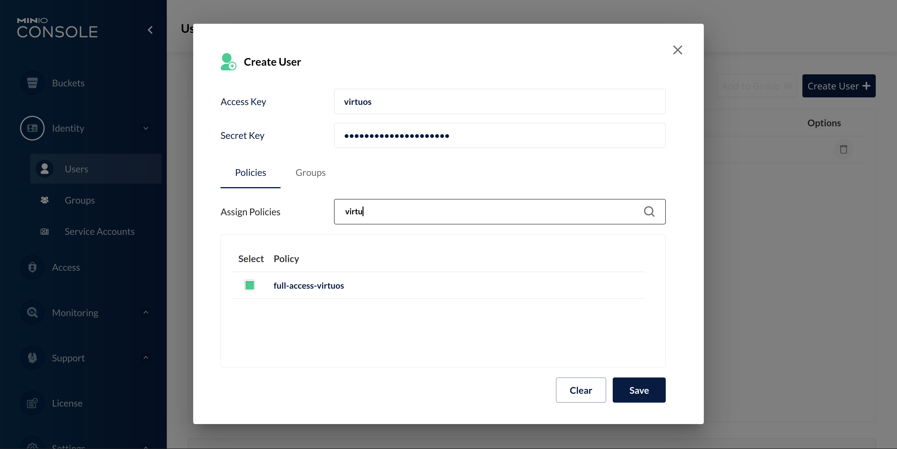
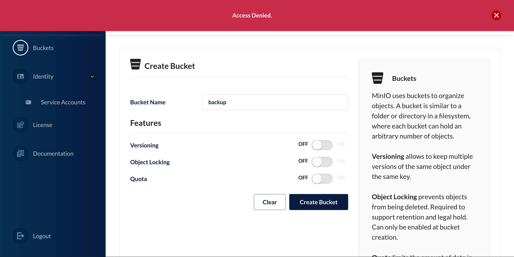

# Make use of MinIO Service Accounts

We use MinIO to provide S3 storage for a while.
It works great, and now powers lots of services, backup systems and individual file storage.

But while we just started with a simple account and a few buckets,
we quickly realized that we need a better structure and more separation between services.
No GitHub Action workflow should have access to internal data or (accidentally) overwrite a backup.

For that, we started introducing separate accounts in MinIO and finally allowed users to easily create service accounts for whatever they need.
Using service accounts, each service now has its own login credentials and is only able to access its part of the overall storage.
You cannot accidentally overwrite someone else's data.
More than that, loosing a service account will only ever endanger that one service.


## Idea and Structure

The access control lists used for S3 grant an almost infinite amount of flexibility.
It's still best to start with a very simple structure,
extending it only if necessary.

In our case, we have three different types of accounts:

- The **global admin** account is basically used only to create team accounts.
 Everything else is handled by accounts with fewer privileges.
 This also means, that this account can be well protected.
- The **organization** or **team accounts** let teams manage their own service accounts and buckets.
 This could e.g. be an operations team managing service backups for different services.
- The **service accounts** are for individual services.
 Only these accounts hold buckets.
 They are used for isolating storage areas.
 This means that e.g. one service cannot access data from another service.

The resulting structure looks like this:

```
admin account
|
+- team account 1 (team1)
|   + service account team1-a
|   |  +- bucket team1-a
|   + service account team1-b
|      +- bucket team1-b
|
+- team account 2 (team2)
|   + service account team2-c
|   |  +- bucket team2-c
…
```

If necessary, additional layers could be added to this,
but using only three levels makes the structure less complex and neatly fits the MinIO account and service account model.

Next, let us see how this works in MinIO.


## Create Team Accounts

As an example, we will create an account for a team called `virtuos`.
Once created, the team can then create their own service accounts.

Before we create a new account, we need to create a new access policy defining the user's privileges.
To add a new policy, log in as admin and navigate to _Access_ → _IAM Policies_ and click _Create Policy_.

In the dialog, create a policy named `full-access-virtuos` with a policy definition like this:

```json
{
    "Version": "2012-10-17",
    "Statement": [
        {
            "Effect": "Allow",
            "Action": [
                "s3:*"
            ],
            "Resource": [
                "arn:aws:s3:::virtuos-*"
            ]
        }
    ]
}
```

This policy will grant full access to all S3 resources with the prefix `virtuos-`.
That means that accounts with this policy active can later, for example, create buckets, but their name must always start with `virtuos-`, clearly assigning them to this account we want to create.

This policy will later also define the maximum privileges service accounts may have.
That means that users could later limit a service account to only have access to a bucket named `virtuos-backup`, but the account may never grant a service account the privilege to access e.g. `datacenter-xy`.

Now that we have our access policy, we can create the actual account.
For that, navigate to _Identity_ → _Users_ and click on _Create User_.



In this dialog, set the access key (which is basically the username) to `virtuos` and set a strong password.
Additionally, activate the access policy `full-access-virtuos` we just created for this account.

After hitting _Save_, we are done, and you can log out as admin and hand over the team account.
Everything else, like creating service accounts and buckets now happens in the new account.


## Service Accounts and Buckets

As an example, we want to create a service account and bucket to back up the database of a service called Greenlight.
All this happens within the team `virtuos` we just created.
The team can now create service accounts and buckets as long as they stay in their prefix `virtuos-`.

First, log in as `virtuos` on the MinIO Console.
We will start by adding a new bucket and then add a service account for this bucket.
You can also do that the other way around.
It doesn't matter.

Navigate to _Buckets_ and click on _Create Bucket_.
If you want, you can try naming it `backup`.
You should end up with an error saying that you are not allowed access to this.
Your name does not start with `virtuos-` after all.



If you change the name to `virtuos-greenlight-backup`, you should be able to create the bucket.
Of course, you can also set different bucket features based on your requirements.

Now that we have a bucket, we will create a service account which may access only this bucket. To do that, navigate to _Identity_ → _Service Accounts_ and click on _Create service account_.

Similar to creating a user, you are asked to provide an access key and a secret key.
Both fields are pre-filled with a random string.
That is great for the secret key, but I recommend changing the access key to something which will let you identify what this account is used for.
Otherwise, you may need to sift through a bunch of access control lists to figure out what the correct account for a bucket is if you ever want to manage existing accounts later on.

In addition to the keys, you are also asked if you want to restrict this service account beyond the user policy.
If you don't, the service account will have the same permissions the user account itself has.
We want to limit access to a specific bucket, though.

Activating this option will give us a template of the user's access policy to edit.
The easiest way of narrowing down permissions is to simply update the resource definition and set it to the name of the bucket we created earlier:

```json
{
    "Version": "2012-10-17",
    "Statement": [
        {
            "Effect": "Allow",
            "Action": [
                "s3:*"
            ],
            "Resource": [
                "arn:aws:s3:::virtuos-greenlight-backup/*"
            ]
        }
    ]
}
```

It is possible to narrow this down further and allow only specific S3 actions,
but in this simple version you already limit access quite a bit and this is simple enough for people to actually remember.

If you want more restrictions, take a look [at this discussion on Stack Overflow about S3 access](https://stackoverflow.com/a/35255100/2352895).

You have now successfully created a service account.
You cannot use this account to log into the MinIO Console.
But if you test this using `s3cmd`, you see that you can only see and access the bucket we created and nothing else:

```bash=
❯ s3cmd -c s3cfg ls s3://
2022-09-04 10:30  s3://virtuos-greenlight-backup

❯ s3cmd -c s3cfg put *md s3://virtuos-greenlight-backup/
upload: 'index.md' -> 's3://virtuos-greenlight-backup/index.md'  [1 of 1]
 4208 of 4208   100% in    0s   165.17 KB/s  done

❯ s3cmd -c s3cfg ls s3://virtuos-greenlight-backup/     
2022-09-04 11:01         4208  s3://virtuos-greenlight-backup/index.md
```

Like this, you can now leave the management of buckets and accounts to individual teams, and they can easily create buckets and service accounts for each task.
There is no excuse for reusing the same accounts and buckets over and over.
It is an easy way of making services more secure.


<time>Sun Sep  4 01:05:26 PM CEST 2022</time>
