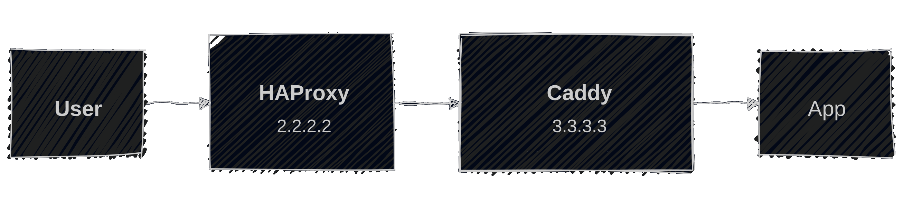

# HAProxy, Caddy, PROXY Protocol and X-Forwarded-For

Or how to pass on a user's IP address through HAProxy and Caddy to an application.

## Documentation

Let's start with some documentation references for anyone who wants to dig deeper:

- [HAProxy ⋄ Add an X-Forwarded-For header](https://www.haproxy.com/documentation/haproxy-configuration-tutorials/proxying-essentials/client-ip-preservation/add-x-forward-for-header/)
- [HAProxy ⋄ Enable the PROXY protocol](https://www.haproxy.com/documentation/haproxy-configuration-tutorials/proxying-essentials/client-ip-preservation/enable-proxy-protocol/)
- [Caddy ⋄ Default handling of X-Forwarded-For](https://caddyserver.com/docs/caddyfile/directives/reverse_proxy#defaults)
- [Caddy ⋄ PROXY Protocol](https://caddyserver.com/docs/caddyfile/options#proxy-protocol)
- [Caddy ⋄ PROXY Protocol (Module)](https://caddyserver.com/docs/modules/caddy.listeners.proxy_protocol)
- [Caddy ⋄ Trusted Proxies](https://caddyserver.com/docs/caddyfile/options#trusted-proxies)
- [Caddy ⋄ client\_ip](https://caddyserver.com/docs/caddyfile/matchers#client-ip)
- [Caddy ⋄ remote\_ip](https://caddyserver.com/docs/caddyfile/matchers#remote-ip)

## The Set-up

We have an application cluster with HAProxy as an initial load balancer and Caddy in front of the apps. The flow of a request to an app therefor looks like this:



<!--
https://mermaid.live/edit#pako:eNplkF1vgyAUhv-KOdeWISoqMSZNd7GLXSxLdrPaCyr0IxMxqFm7pv99QNt06TghvOfwPucQTtBoIYHBptXfzY6bMXh9r7vAro9BmmA2q4KX-ZvRh6PXCy7ERc37_uK7u5flunJn-bSuyrWpykHxtq0i5GN1MV67Oe9VPtgJ8uEq8sBV30rUaHWl_XzHevFAxsiHqzTuGv3n7auXdv-BEuRjBSFszV4AG80kQ1DSKO5SODmyhnEnlayBWSm4-aqh7s6W6Xn3qbW6YUZP290tmXrBR_m851vDrWPD28FZZCekWeipG4FlJPI9gJ3gACxKCkSzlJKcUhLhIs5DOAJLsP2QJM3SHKeUJpieQ_jxUzGiOSEkijKS4jjHRXH-BRo8jWo
-->

Of course, we still want to know who is doing requests against the applications. Sometimes just for analysis and debugging, sometimes for limiting access to certain IP ranges.

In short, we need a solution of how to pass on the user's IP addresses from HAProxy to Caddy and finally to the application. This means configuring HAProxy and Caddy properly. That is what this article is exploring.


### Testing Environment

For testing purposes, the app I use will just print the final request passed on from Caddy.
To see what values `remote_ip` and `client_ip` have, as well as what HAProxy sends as `X-Forwarded-For` header, I configured Caddy to pass these values on as HTTP headers:

```
request_header X-original-forwarded-for {header.X-Forwarded-For}
request_header X-remote-ip {remote}
request_header X-client-ip {client_ip}
reverse_proxy 4.4.4.4:8000
```


## Defaults

**HAProxy** neither adds `X-Forwarded-For` headers nor uses the PROXY protocol by default. It will also not modify or block any `X-Forward-For` headers sent by clients, but just pass them through to the backend.

**Caddy** always adds `X-Forwarded-*` headers by default, replacing existing ones. It will not use the PROXY protocol.

## Behavior with no additional configuration

This is the basic HAProxy backend configuration we will base all our tests on. It's nothing special. It uses the HTTP proxy mode, requires valid TLS certificates and configures HAProxy to use SNI (Caddy may complain otherwise):

```
backend caddy_server
    mode http
    default-server ca-file /etc/ssl/certs/ca-bundle.crt check ssl verify required sni req.hdr(host)
    server s1 caddy.example.com:443
```

The Caddy configuration is also very simple. There are just the additional headers passed on already mentioned above:

```
caddy.example.com {
    request_header X-original-forwarded-for {header.X-Forwarded-For}
    request_header X-remote-ip {remote}
    request_header X-client-ip {client_ip}
    reverse_proxy 4.4.4.4:8000
}
```

Executing a request with `curl -Is example.com`, the result of this configuration is:

```yaml
❯ nc -l 8000
HEAD / HTTP/1.1
Host: example.com
Via: 1.1 Caddy
X-Client-Ip: 2.2.2.2
X-Forwarded-For: 2.2.2.2
X-Forwarded-Host: example.com
X-Forwarded-Proto: https
X-Original-Forwarded-For: 
X-Remote-Ip: [2.2.2.2]:39812
```

So, while the host is actually what we originally requested. All client references are pointing to the IP address of HAProxy. If we want the actual IP address of the user to show up here, we need a different configuration.

Moreover, we should be aware that HAProxy is not sending an `X-Forwarded-For` header and, even more important, will forward any `X-Forwarded-For` header send by the user. For example, sending `1.2.3.4` in the header link this:

```
❯ curl -sI -H 'X-Forwarded-For: 1.2.3.4' https://example.com
```

Will result in HAProxy forwarding this header to Caddy:

```yaml
X-Forwarded-For: 1.2.3.4
```

This is no problem with Caddy as it does not trust incoming traffic by default and it will replace the header:

```yaml
X-Forwarded-For: 2.2.2.2
```

For other applications, running behind HAProxy like this could be a problem, however. It is something you should fix.


## PROXY Protocol between HAProxy and Caddy

We can use the PROXY protocol as a wrapper around requests to provide additional context to Caddy. What is nice about this is, that this not only works with HAProxy as HTTP proxy, but even when it is acting as a TCP proxy. There are two versions of the protocol. In our configuration, we use the newer binary version.

The configuration is almost identical. HAProxy makes it very easy to activate the PROXY protocol by just adding `send-proxy-v2` to the server configuration:

```
backend caddy_server
    mode http
    default-server ca-file /etc/ssl/certs/ca-bundle.crt check ssl verify required sni req.hdr(host)
    server s1 caddy.example.com:443 send-proxy-v2
```

This means, however, that HAProxy and Caddy are no longer speaking just HTTP, and we need to instruct Caddy to unwrap the requests and interpret the PROXY protocol.

We also want to tell Caddy to not accept the PROXY protocol from just anyone to prevent requests from external sources to spoof their IP address.

Adding this to the configuration looks like this:
```
{
    servers {
        listener_wrappers {
            proxy_protocol {
                # Allow PROXY protocol from HAProxy
                allow 2.2.2.2
            }
            tls
        }
    }
}

caddy.example.com {
    …
}
```

Now making a request, HAProxy will pass on the user's IP address and Caddy will treat the entire request as if there was no HAProxy in between:

```yaml
❯ nc -l 8000
HEAD / HTTP/1.1
Host: example.com
Via: 1.1 Caddy
X-Client-Ip: 1.1.1.1
X-Forwarded-For: 1.1.1.1
X-Forwarded-Host: example.com
X-Forwarded-Proto: https
X-Original-Forwarded-For: 
X-Remote-Ip: 1.1.1.1:53402
```

This means that you can use matchers for `client_ip` and `remote_ip` in Caddy to handle requests from certain clients. For example, you can block access from some IP ranges.

When using the PROXY protocol, Caddy will interpret its metadata before handling the HTTP address and adjust both `remote_ip` and `client_ip`. There is no difference between these matchers and you can use either to match the user's IP address:

```
@forbidden_networks not client_ip 1.2.3.0/24
@forbidden_networks not remote_ip 1.2.3.0/24
```

This means that you gain the ability to block end-users, but lose the ability to match the ability to match HAProxy's IP address.


## Let HAProxy set X-Forward-For

As an alternative to the PROXY protocol, HAProxy can set `X-Forward-For` headers in any request and pass the user's IP address on like this. This only works in HTTP mode since HAProxy has to manipulate the HTTP request. In TCP mode, this is impossible. This will also replace any `X-Forward-For` headers sent by users.

Activating this in HAProxy is very simple. Just add `option forwardfor` to the configuration:

```
backend caddy_server
    mode http
    option forwardfor
    default-server ca-file /etc/ssl/certs/ca-bundle.crt check ssl verify required sni req.hdr(host)
    server s1 caddy.example.com:443
```

We earlier established that that Caddy will drop all incoming `X-Forwarded-*` headers though. To prevent this, we must specifically mark incoming requests from HAProxy as trusted by configuring its IP address in the global option `trusted_proxies`:

```
{
    servers {
        trusted_proxies static 2.2.2.2
    }
}

caddy.example.com {
    …
}
```

This will result in Caddy accepting or augmenting the `X-Forwarded-*` headers from HAProxy:

```yaml
❯ nc -l 8000
HEAD / HTTP/1.1
Host: example.com
Via: 1.1 Caddy
X-Client-Ip: 1.1.1.1
X-Forwarded-For: 1.1.1.1, 2.2.2.2
X-Forwarded-Host: example.com
X-Forwarded-Proto: https
X-Original-Forwarded-For: 1.1.1.1
X-Remote-Ip: [2.2.2.2]:60950
```

Other than when using the PROXY protocol, `remote_ip` and `client_ip` also have different values this time:

- `remote_ip` is the IP address of the immediate peer. That is HAProxy.
- `client_ip` is the user's IP address

This means that you can use these matchers for different purposes. Example matchers:

- To only allow connections via HAProxy, preventing anyone from connecting to Caddy directly:
    ```
    @forbidden_networks not remote_ip 2.2.2.2
    ```
- To only allow requests from the user with the IP address `1.1.1.1`:
    ```
    @forbidden_networks not client_ip 1.1.1.1 ::ffff:1.1.1.1
    ```

These options make it more flexible than using the PROXY protocol. But keep in mind that you can only use this when HAProxy is active as HTTP proxy.


## Combining PROXY Protocol and X-Forwarded-For

Usually, combining both does not make sense. If you do, however, there are a few important things to consider:

- The metadata from the PROXY protocol is applied first. This means that all references to the HAProxy (direct peer's) IP address will be replaced.
- This means that setting the `trusted_proxies` configuration to the IP address of HAProxy will have no effect. It will never see that address. To that mechanism, it seems like the traffic is coming from the user directly.
- To accept the `X-Forwarded-For` header from HAProxy, you would therefor need to configure the IP address of the user as trusted proxy. This is obviously not a great idea.

All this means that there would need to be another  proxy in front of HAProxy you could actually trust. And even then, you could just not use HAProxy's proxy protocol but just let HAProxy pass on the `X-Forwarded-For` header it gets.


## IPv4 and IPv6

Depending on your IPv4 and IPv6 configuration, HAProxy and/or Caddy may use the IPV6 representation of IPv4 addresses in the `X-Forwarded-For` header and the PROXY protocol metadata. To be safe, you may want to configure both in matchers. For example, configure `2.2.2.2` and `::ffff:2.2.2.2` like this:

```
@public_networks not remote_ip 2.2.2.2 ::ffff:2.2.2.2
```


## Conclusion

Both marking HAProxy as trusted and using `X-Dorwardd-For` headers as well as using the PROXY protocol will work for passing on the user's original IP address. Using `trusted_proxies` and `X-Forwarded-For` seems simpler, though. In most situations, this would be my preferred method.

The PROXY protocol was added to Caddy later on and it shows. The documentation about how this impacts matchers like `remote_ip` is often missing or misleading. Hopefully Caddy will improve this in the future, staring with a two documentation pull requests from me[¹⁾](https://github.com/caddyserver/caddy/pull/7447)[²⁾](https://github.com/caddyserver/website/pull/521).


<time>
Sun Jan 25 09:30:26 PM CET 2026
</time>
