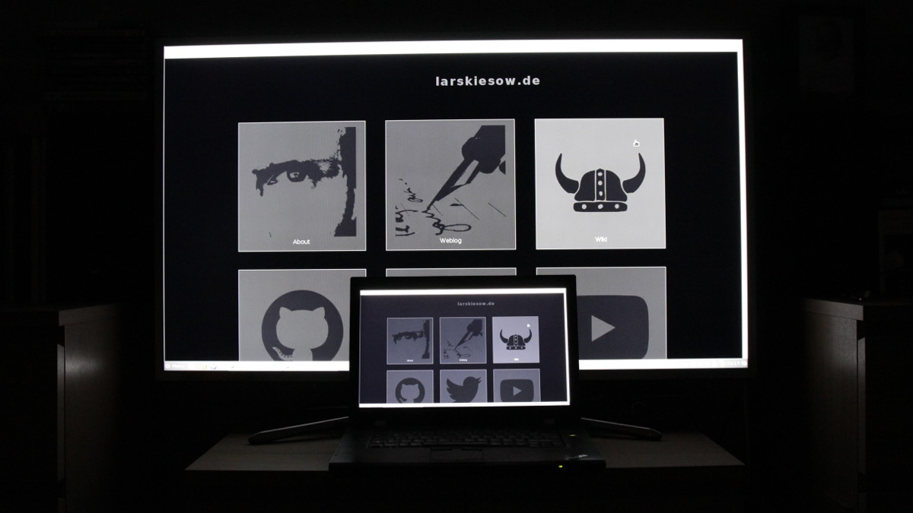

Raspberry Pi Network Screen Mirroring
=====================================

Nearly two years ago, I [demonstrated](https://youtu.be/1EV3xZykn2I) that a
[Raspberry Pi](https://raspberrypi.org) could be used to achieve network based
screen mirroring. Since then, I received a couple of requests from people
asking how to implement this or even if I could implement a specific version
for them.

That is why I decided to give it another try and properly document what you
need to do in order to get things working.

The Idea
--------

The basic idea behind the set-up is quite simple:

1. Capture screen
2. Encode video while capturing
3. Send video over the network
4. On the Raspberry Pi, listen for video stream on network
5. Use hardware decoder to play back video

This is essentially what every network based display technology does. AirPlay
does it, Miracast does it, Steam does it, … What we need is only a device
taking this network stream and decoding/displaying it as fast as possible.

The Raspberry Pi is a really cheap way of decoding MPEG4 and H264 encoded video
in hardware. It also has a huge community and can natively run Linux. This
makes it a good platform to try building a video stream receiver.

Requirements
------------

For my first tests in 2014 I used a Raspberry Pi Model B rev2. This model is
still available and there is no reason why it would not work. Still if you want
to buy one anyway, I recommend the B+ or the Raspberry Pi 2 since both tend to
be more stable and the RPi 2 has a lot more power. If you are still thinking:
By a Raspberry Pi 2.

For the operating system, I recommend [Raspbian Jessie
Lite](https://raspberrypi.org/downloads/raspbian/). Raspbian is specifically
built for the Raspberry, has everything you need and generally a good starting
point.  The drawback is, that even the *lite* version is very large. But for
now that is no real problem.

You should follow the official installation guides and have Raspbian installed
as well as updated for the rest of this article.

On the host system–the system you want to grab the screen from–you should have
a recent version of [FFmpeg](https://ffmpeg.org) installed. FFmpeg needs to be
compiled with support for the `x11grab` device. You can check that by running:

    % ffmpeg -devices | grep x11grab
    ...
     D  x11grab         X11 screen capture, using XCB

This should do for a first test.

First Try
---------

Make sure you have shell access to both your host computer and to the
raspberry. For a first try, lets just start the receiver manually and use
FFmpeg to grab and stream our screen.

First, on the raspberry, run:

    omxplayer udp://0.0.0.0:8888

Then, on the host, run something like:

    ffmpeg -f x11grab -s 1920x1080 -i :0.0 -c:v mpeg4 \
      -f mpegts udp://raspberrypi.home:8888

The result:

The OMXPlayer will simply listen for a network stream from any host on port
`8888` and try to play back what is sent. Note that if no data are sent, it
will terminate itself after a while. So either be quick or let the player run
in a loop.

On the host, FFmpeg will use `x11gram` to capture an area the size of
`1920x1080` pixels from screen `0`. It will then use its native mpeg4 encoder
to encode the video and ship it as MPEG transport stream via UDP to the network
device with the domain name `raspberrypi.home` which happens to be my Raspberry
Pi 2. If you have no DNS server running in your network, just replace it with
the Raspberry Pi's IP address.

So we got this running which is great. But if you play around with this a bit,
you will notice that the image quality is not exactly the best. And here the
variations begin…

Some Initial Tweaks
-------------------

Playing a bit with some options I noticed that there are some easy ways to
improve the systems performance. That said, I do not claim to have found the
best options and in any case, what you want to use depends on your
environmental parameters like encoder, cpu, network speed, network delay, …
Just try to play a bit for yourself to figure out the best options for your
environment.

First of all, by default FFmpeg will try to record 29.97 fps. I noticed that
the Raspberry, while recognizing the 29.97 fps, seemed happier with 30 fps.
Also on some systems or in some situations, the host system may not manage to
encode 30 fps. That is why for presentations or other static content, I would
recommend to just turn this down as low as you dare.

The FFmpeg option to do this is:

    ffmpeg -r 15  -f x11grab ...

The second important FFmpeg options is the bitrate. Since we want to do
streaming as fast as possible, we want a fixed bitrate. But the default bitrate
is probably a bit low. The exact value you want to use here should definitely
depend on your network since it directly affects the used bandwith.

The FFmpeg option to set this is:

    ... -c:v mpeg4 -b:v 5000k -f mpegts ...

Finally there are two interesting options for the OMXPlayer. The first option
is `-b` which is used to blank the remaining screen if a video is played back
and it does not exactly fir due to its aspect ratio. It is much prettier and
less confusing than having a shell in the background.

The second options is `--live` for which the documentation says “Set for live
tv or vod type stream”. Since we do have a stream, I set it without exactly
knowing what it does. My guess would be that the player will not try waiting
for missing frames, etc. But that is just a guess.

The full OMXPlayer call would then look like this:

    omxplayer -b --live udp://0.0.0.0:8888

Better Video Codec: H264
------------------------

The mpeg4 encoder we used before is easy to use, directly built into FFmpeg and
works great. But the Raspberry Pi also has a H264 decoder. H264 is basically
the next generation video codec and offers much better quality given a fixed
bandwith.

To use this, your FFmpeg needs to be linked against `libx264` which is a very
widely adapted, very fast and very reliable H264 encoder FFmpeg can work with.

You would then use an FFmpeg command line similar to this one:

    ffmpeg -r 15 -f x11grab -s 1920x1080 -i :0.0 -c:v libx264 \
	   -pix_fmt yuv420p -preset veryfast -tune zerolatency \
		-bsf:v h264_mp4toannexb -b:v 5000k -bufsize 500k -f mpegts \
		udp://raspberrypi.home:8888

In short, this uses the libx264 encoder to encode the video using a pixel
format that is usable by the Raspberry and making the video stream ready for an
MPEG transport stream. Finally, it will also set the frame rate, the bit rate
(note that is is an advice, it is not a fixed bitrate) and an initial buffer.

More Ideas
----------

While everything works great, there are still some problems that could get
resolved. First of all, you need to start the player manually. An easy fix is
to just run the player in a loop like this:

    while true; do omxplayer -b --live udp://0.0.0.0:8888; done

But while testing I actually managed to stop this from working properly, by
sending some arbitrary data which made the player hang.

This brings us to the next problem which is that the player will listen to data
from all hosts, just playing back what it will get. That may lead to weird
images and a player that is best restarted when you start sending videos from
multiple devices at the same time.

A proper way dealing with this would be to have a small initialization
protocol, telling the Raspberry that it should listen to data from a specific
device only. This could also be used to cut the connection and close the player
at the end of a transmission, instead of just waiting for the player to quit on
its own.

Finally, I am convinced that there is still room for tweaking the encoding. One
interesting idea would be to use the hardware encoder available in newer CPUs
and GPUs. This would take away the encoding load from the main CPU, putting
less load on the whole system and may be a lot faster, dropping the delay quite
a bit.

Speaking about delay, finally, doing fixed bit-rate encoding, no codec
discovery and setting the buffers as low as possible could furthermore have a
positive effect on the delay.

<time>Tue Feb 16 00:26:08 CET 2016</time>
