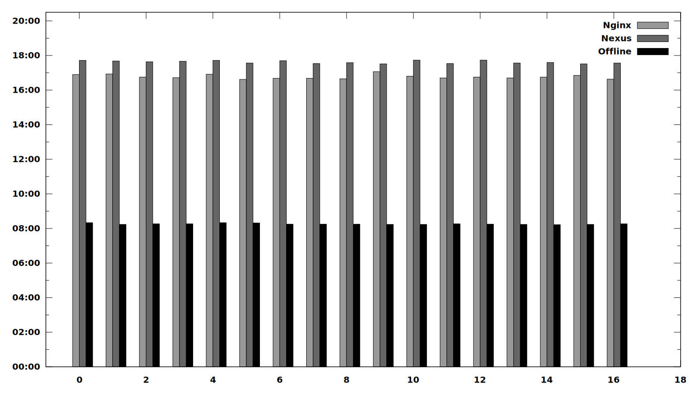

Nginx VS Nexus: Performance Test
================================

When I was first [trying out Nginx as a Maven repository proxy
](../20170413-nginx-as-fast-maven-repository-proxy.md) it already felt
like Nginx was more performant and in any case less memory consuming than
Nexus but with the systems running on completely different hardware, there was
no way of getting accurate information about the speed difference..

That is why I set-up a test scenario with both systems running on the same
infrastructure and doing several builds against the servers to get comparable.

Test Scenario
-------------

For the test I used one of the Opencast Nexus servers and run tests against the
set-up with the latest version of Nexus. Then I switched the configuration to
Nginx with Nexus shut down and repeated the same test.

The machine I used for that was an AWS VM with 4GB of RAM and two cores.
Nothing too powerful, but it should be enough for the test.

For testing, I then used the following script to repeatedly do a fresh build of
Opencast with all local caches wiped clean:

    for i in `seq 1 20`; do
      git clean -fdx
      rm -rf /home/lars/.m2/repository
      mvn -e clean install -Pdev | \
        grep -A3 'BUILD SUCCESS' | \
        grep 'Total time:' >> ~/buildtime.log
    done

The test was run at the [University of Osnabrück](http://uos.de) on a fast
desktop machine with a gigabit internet uplink over the Easter holidays,
meaning that there was not much else going on on the campus network at the
time.  Optimal conditions to get data from the internet really fast.

For comparison, I also run the same test with everything cached locally and
Maven in offline mode using:

    for i in `seq 1 3`; do
      mvn -e --offline clean install -Pdev | \
        grep -A3 'BUILD SUCCESS' | \
        grep 'Total time:' >> ~/buildtime.offline.log
    done

Note that I did run three initial builds on Nginx to fill up its cache. The
builds worked perfectly fine but were about 14min slower since all artifacts
were requested from the projects main Nexus server. But that would be something
Nexus would need to do as well on its first start.

The Result
----------

This plot shows the build times for 18 builds of Opencast each with Nginx,
Nexus and in offline mode. For the complete list of results, have a look at
[the data file](build-time.dat).

While the difference is not devastatingly large, is is clear to see that Nginx
is constantly faster. With an average time of 16:46min for Nginx and 17:37min
for Nexus, there is a noticeable 0:51min average difference.

Conclusion
----------

In this test Nginx showed that it definitely performs better than Nexus.  Given
that Nginx also needs less resources I suspect that under high load the
difference would be even greater.

With these performance advantages and the reduced maintenance necessary for a
tool packaged in all common Linux distributions, for me, Nginx is the clear
winner and I will probably replace all except one Nexus server, on which
features like uploading artifacts, … are actually used.

<time>Mon Apr 17 23:16:47 CEST 2017</time>
